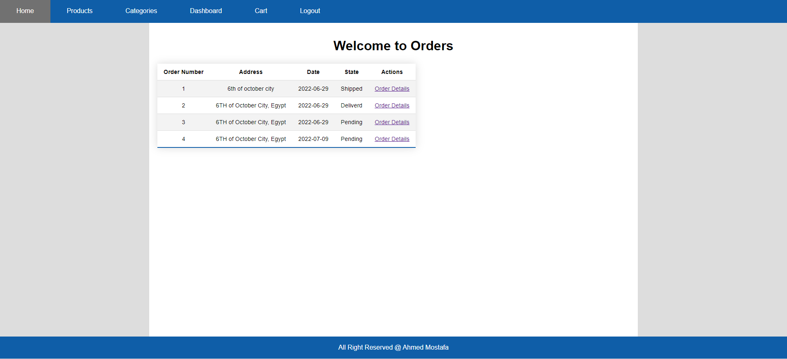

# E Commerce With Java Servlet
## Basic E Commerce Website With Admin Dashboard
## Features
 
1 - View Products By Categorys
 
2 - View Product Details
 
3 - Add Product To Cart
 
4 - View My Cart
 
5 - Send To Delivery
 
6 - Admin Create Categories
 
7 - Admin Create Products
 
8 - Admin Control Orders
 
9 - Admin View Users
 
10 - Users Login and Register

## Screens

  
  
  
  
  
  
  
  
  
  
  
  

## How to Use
 
1 - Fork The Repository
 
2 - Clone
 
3 - Install TomCat Server
 
4 - Import MySql database File from here https://github.com/Ahmed199810/E-Commerce-Servlet/tree/main/database
 
5 - Start
